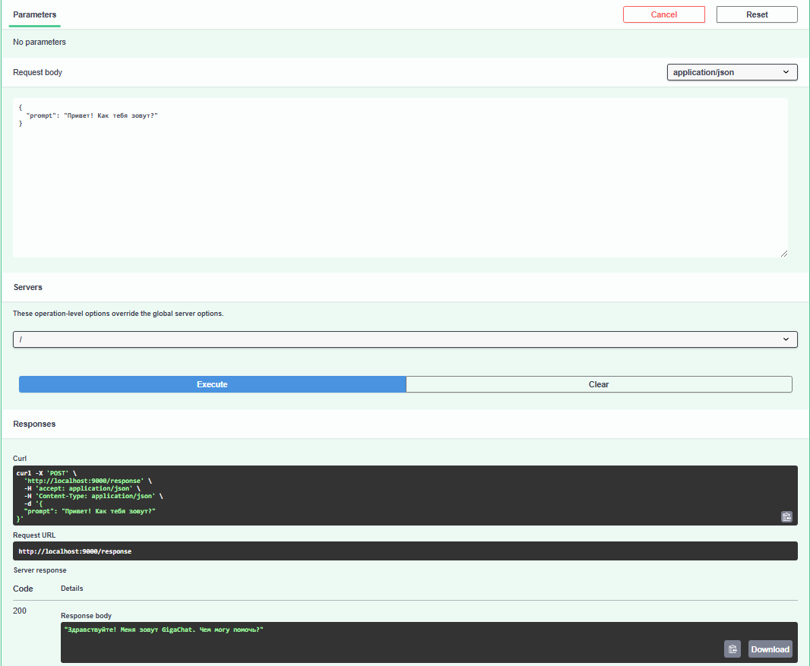

# Практика 1: GigaChat-API в докер-контейнере

## Отчет по заданию

Шаг 0: Переходим в `./practice-1`

### Сборка и запуск плохого контейнера

Шаг 1: Сборка образа

```bash
docker build -t pr1_bad -f Dockerfile.bad .
```

Шаг 2: Запуск контейнера
```bash
docker run -p 9000:9000 pr1_bad
```

### Сборка и запуск хорошего контейнера

Шаг 1: Сборка образа

```bash
docker build -t pr1_good -f Dockerfile.good .
```


Шаг 2: Запуск контейнера
```bash
docker run -p 9000:9000 --env-file .env pr1_good
```

### Плохие практики и их решения
1. **Использование жирного образа**     
    **Проблема**: Большие образы занимают много памяти и замедляют сборку.      
    **Решение**: Использовать более легкие образы, такие как `python:3.10-slim`, чтобы уменьшить размер и ускорить развертывание.     
2. **Копирование всего, включая `.env`, и неиспользование `.dockerignore`**     
    **Проблема**: Копирование лишних файлов (например, `.env`) в контейнер нарушает безопасность и увеличивает размер образа.       
    **Решение**: Создать `.dockerignore` и исключить конфиденциальные и прочие файлы, чтобы они не попадали в образ.       
3. **Разделение команд, что увеличивает количество слоев**      
    **Проблема**: Отдельные команды RUN создают избыточные слои, увеличивая размер образа.      
    **Решение**: Объединить команды в одну строку с использованием `&&`, чтобы оптимизировать создание слоев.       

### Плохие практики в целом
1. **Запуск монолитного приложения**: Docker лучше подходит для микросервисов, где контейнеризация действительно повышает гибкость и модульность. Монолит в контейнере может оказаться излишне громоздким и сложным для управления.
2. **Запуск приложений с высоким уровнем безопасности**: Если нужна сверхвысокая безопасность, например, для приложений с конфиденциальными данными, контейнеры также не лучший выбор. Из-за общего ядра хоста контейнеры не обеспечивают такой уровень изоляции, как виртуальные машины, что может повысить риск уязвимостей.

### Результат

