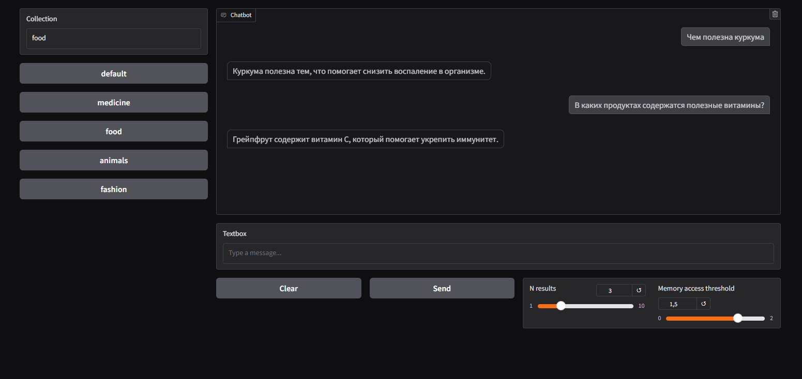

# Практика 2: Базовый RAG в докер-контейнере

## Отчет по заданию

### Структура

Docker Compose состоит из 4 сервисов:
1. `ChromaDB` - Векторное хранилище данных
2. `LLM-RAG` - API, представляющее сущность LLM
3. `WebUI` - Web-интерфейс
4. `Init` - Инициализатор базы данных, если она пуста

Все требования к [docker-compose.yml](docker-compose.yml) соблюдены.

### Доступ

API LLM-RAG: http://localhost:9000/docs      
API ChromaDB: http://localhost:8000/docs     
WebUI: http://localhost:7860    

### Результат
