# Практика 3: Kubernetes

## Отчет по заданию
1. Запуск minikube
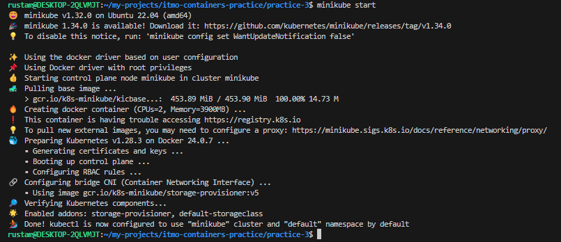
Исправляем проблему с доступом `https://registry.k8s.io` командой `sudo bash -c 'echo "nameserver 8.8.8.8" > /etc/resolv.conf':     
`:      
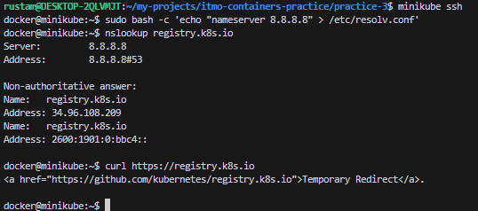

2. Проверка установки
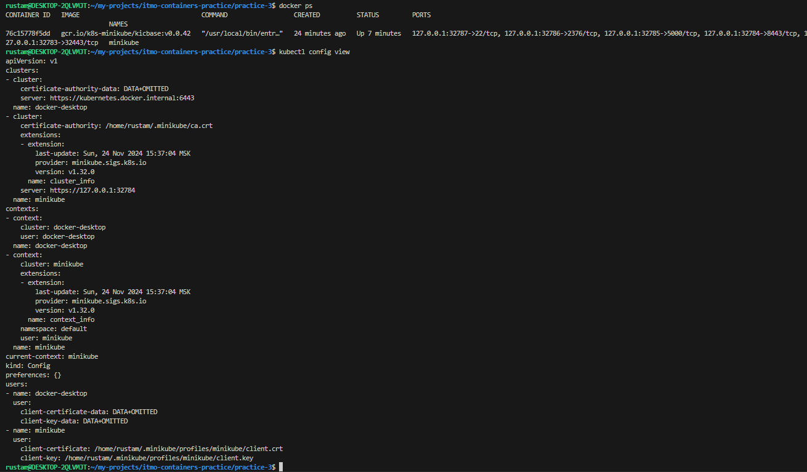

3. Создание объектов из манифестов
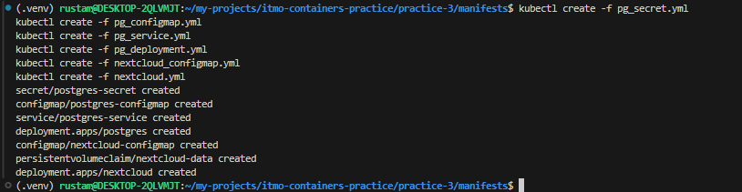

4. Проверка     
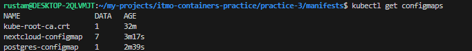
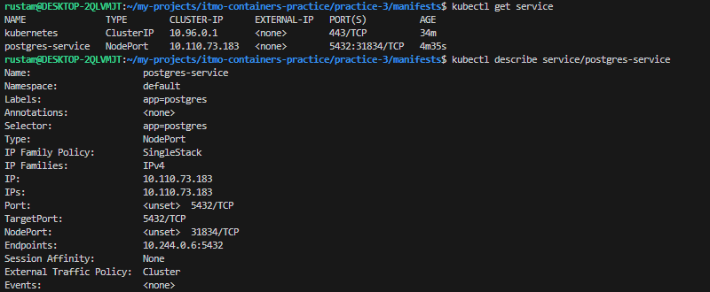
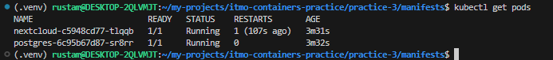
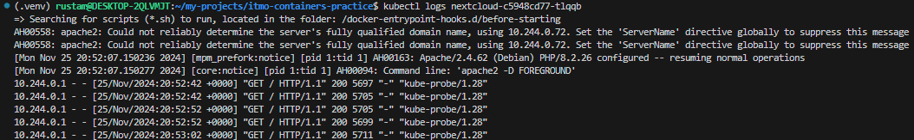
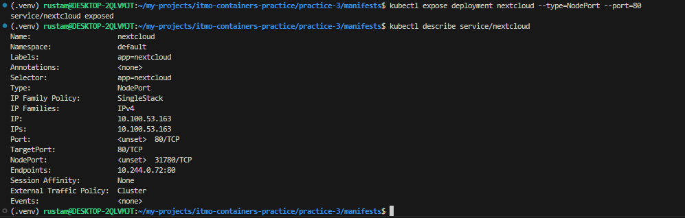

5. Туннелирование трафика
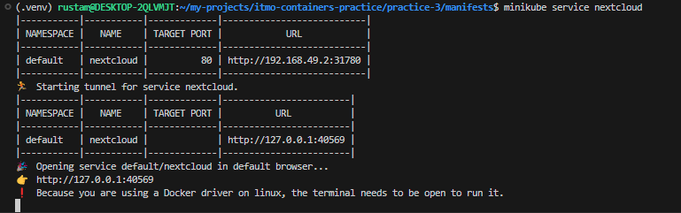

6. Переход по ссылке
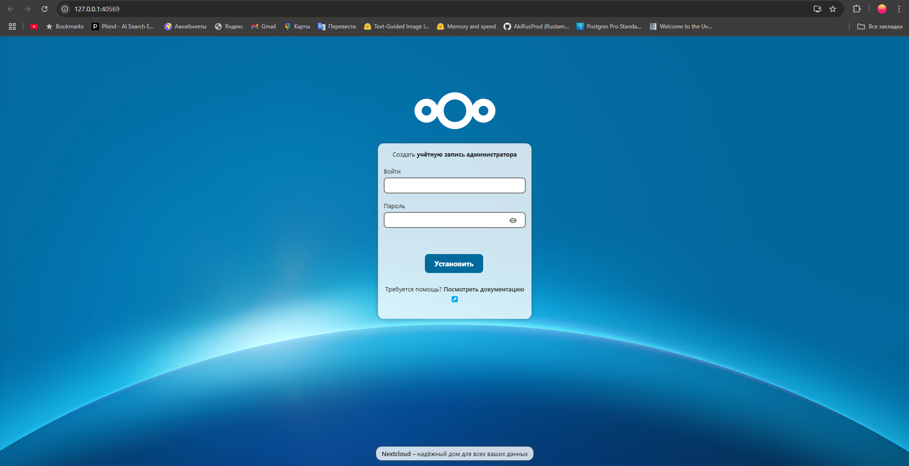

6. Дэшборд