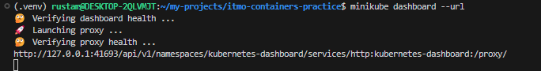
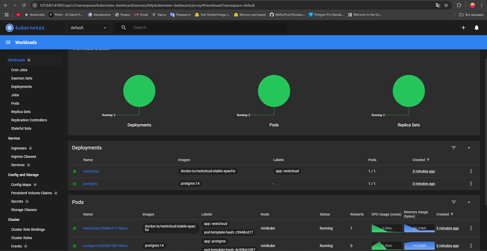

# Практика 3: Kubernetes

## Отчет по заданию
1. Запуск minikube      

2. Исправляем проблему с доступом `https://registry.k8s.io` командой `sudo bash -c 'echo "nameserver 8.8.8.8" > /etc/resolv.conf'`:              

3. Проверка установки       

4. Создание объектов из манифестов      

5. Проверка     

6. Туннелирование трафика       

7. Переход по ссылке        

6. Дэшборд      

