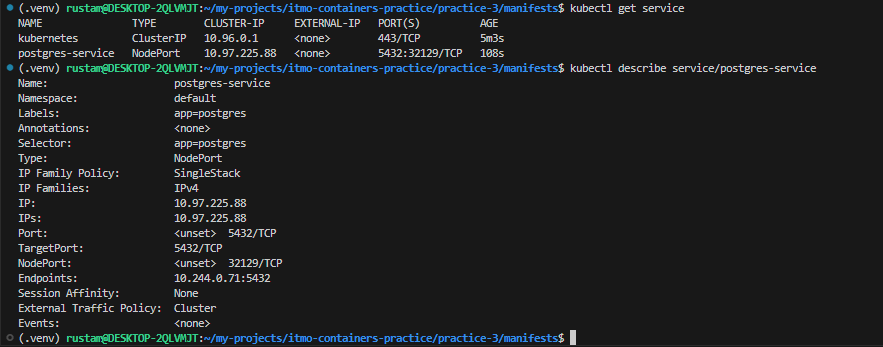

# Практика 3: Kubernetes

## Отчет по заданию
1. Запуск minikube

Исправляем проблему с доступом `https://registry.k8s.io` командой `sudo bash -c 'echo "nameserver 8.8.8.8" > /etc/resolv.conf':     
`:

2. Проверка установки

3. Создание объектов из манифестов

4. Проверка     

