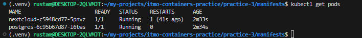

# Практика 3: Kubernetes

## Отчет по заданию
1. Запуск minikube      

2. Исправляем проблему с доступом `https://registry.k8s.io` командой `sudo bash -c 'echo "nameserver 8.8.8.8" > /etc/resolv.conf'`:              

3. Проверка установки       

4. Создание объектов из манифестов      

5. Проверка     

6. Туннелирование трафика       

7. Переход по ссылке        

6. Дэшборд      

## Вопросы
1.  **Важен ли порядок выполнения этих манифестов? Почему?**        
    Ответ: Да, порядок выполнения манифестов Kubernetes может быть важен, поскольку некоторые ресурсы зависят друг от друга. Например, объект Deployment не сможет успешно развернуться, если используемый в нем ConfigMap или Secret еще не созданы. Аналогично, Service будет бесполезным до создания подов, на которые он направляет трафик. Хотя Kubernetes обладает механизмами самовосстановления и со временем устранит несоответствия, следование логическому порядку при применении манифестов помогает избежать временных ошибок и ускоряет развертывание.
2.  **Что (и почему) произойдет, если отскейлить количество реплик postgres-deployment в 0, затем обратно в 1, после чего попробовать снова зайти на Nextcloud?**   
    Ответ: Если отскейлить реплики postgres-deployment до 0, база данных станет недоступной, и Nextcloud потеряет к ней доступ. После возвращения количества реплик к 1 база данных снова будет работать, но Nextcloud сам по себе не восстановит соединение с ней. Чтобы Nextcloud смог подключиться к базе данных, потребуется перезапустить его поды.