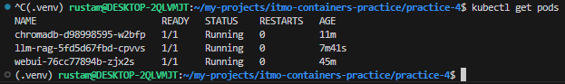

# Практика 2: Базовый RAG в Куберенетес-кластере

## Отчет по заданию

### Старт

```bash
cd practice-4
minikube start
```

### Сборка образов

```bash
# frontend
docker build -t webui ./frontend
minikube image load webui

# backend (Весит 12 Гб, мне удалось его загрузить в миникуб через `tar`)
docker build -t rag ./backend/
docker save rag -o rag.tar 
minikube image load rag.tar
```

### Применение конфигов Kubernetes

```bash
kubectl create configmap llm-config --from-env-file=.env

kubectl apply -f manifests/chromadb_pvc.yaml
kubectl apply -f manifests/chromadb.yaml
kubectl apply -f manifests/llm_rag_pvc.yaml
kubectl apply -f manifests/llm_rag.yaml
kubectl apply -f manifests/webui.yaml
```


### Структура

Кластер состоит из 4 компонентов:
1. `ChromaDB` - Векторное хранилище данных
2. `LLM-RAG` - API, представляющее сущность LLM
3. `WebUI` - Web-интерфейс
4. `Init` - Инит-контейнер, инициализирующий базу данных, если она пуста



### Доступ

Команды для проброса портов:
```bash
kubectl port-forward service/webui 7860:7860
kubectl port-forward service/llm-rag 9000:9000
kubectl port-forward service/chromadb 8000:8000
```

API LLM-RAG: http://localhost:9000/docs      
API ChromaDB: http://localhost:8000/docs     
WebUI: http://localhost:7860    

### Результат


### Дэшборд (minikube dashboard --url)
